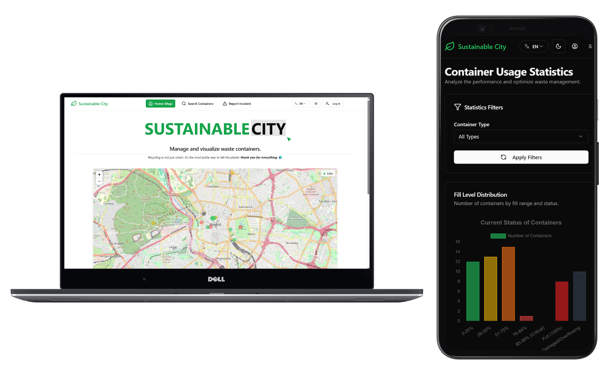

# 🗑️ Smart Waste Management Platform ♻️

The Smart Waste Management Platform is a sophisticated, real-time application designed for municipalities, businesses, or universities to efficiently manage and monitor smart waste containers. It leverages sensor data and a user-friendly interface to optimize waste collection routes, improve operational efficiency, and enhance citizen engagement.

**See the live Demo here:** 👉 [**sustainablecity.antomihe.es**](https://sustainablecity.antomihe.es) 👈

**Please Note:** This platform is currently operating in **Demo Mode**. Due to hosting constraints for the demo backend, it might go to sleep after periods of inactivity (see [⚠️ Demo Server Sleep Mode Notice](#-demo-server-sleep-mode-notice)).



## Table of Contents

- [🎯 Project Concept](#-project-concept)
- [✨ Key Features](#-key-features)
  - [Real-Time Container Monitoring & Simulation](#real-time-container-monitoring--simulation)
  - [User Experience & Accessibility](#user-experience--accessibility)
  - [Internationalization & Communication](#internationalization--communication)
  - [Citizen Engagement & Reporting](#citizen-engagement--reporting)
  - [Advanced Container Search & Filtering](#advanced-container-search--filtering)
  - [Administrator Panel](#administrator-panel)
  - [Operator Panel](#operator-panel)
  - [User Registration & Management](#user-registration--management)
- [🤖 Demo Mode & Data Simulation](#-demo-mode--data-simulation)
- [⚠️ Demo Server Sleep Mode Notice](#-demo-server-sleep-mode-notice)
- [🌱 Seed Data & Demo Users](#-seed-data--demo-users)
  - [Pre-loaded Data](#pre-loaded-data)
  - [Demo Login Credentials](#demo-login-credentials)
- [🛠️ Tech Stack](#️-tech-stack)
- [📂 Project Structure](#-project-structure)
- [📋 Prerequisites](#-prerequisites)
- [🚀 Getting Started](#-getting-started)
  - [🐳 Full Stack Docker Compose (Recommended)](#-full-stack-docker-compose-recommended)
  - [⚙️ Manual Setup](#️-manual-setup)
    - [🐘 Manual PostgreSQL Setup](#-manual-postgresql-setup)
    - [🐳 PostgreSQL with Docker Compose (DB Only - from `/backend`)](#-postgresql-with-docker-compose-db-only---from-backend)
    - [Backend Manual Run](#backend-manual-run)
    - [Frontend Manual Run](#frontend-manual-run)
- [🔑 Environment Variables](#-environment-variables)
- [▶️ Available Scripts](#️-available-scripts)
- [📖 API Documentation](#-api-documentation)
- [📬 Support and Contact](#-support-and-contact)
- [📜 License](#-license)

## 🎯 Project Concept

This platform provides a comprehensive solution for managing intelligent waste containers equipped with sensors. The core idea is to:

-   **Enable real-time monitoring:** Track container fill levels and status (e.g., damaged) via simulated sensor updates, visualized on an interactive map.
-   **Optimize operations:** Allow administrators and operators to efficiently manage container fleets, assign tasks, and respond to incidents.
-   **Foster citizen participation:** Empower citizens to report issues and easily locate containers.
-   **Enhance user experience:** Offer a modern, accessible, and engaging interface with multilingual support.

The system is designed for organizations like city councils, universities, or large businesses aiming to implement smart waste management solutions.

## ✨ Key Features

### Real-Time Container Monitoring & Simulation
-   **Live Map View:** Users are greeted with a real-time map displaying all smart containers and their current status (fill level, damaged, etc.) via WebSocket connections.
-   **(Demo) Simulated Sensor Data:** Due to the absence of physical sensors in this demo, a cron job simulates:
    -   Random container fill level increase every 30 minutes.
    -   Random container damage report every 2 hours.
    -   Random resolution (emptying/fixing) of a full/damaged container every 4 hours.

### User Experience & Accessibility
-   **User-Friendly Interface:** Modern, intuitive design adaptable to mobile devices.
-   **Accessibility Focus:** Built with accessibility best practices in mind.
-   **Light/Dark Mode:** Enhances user comfort and preference.
-   **Comedic Gags:** Small, humorous elements integrated throughout the platform to create a more enjoyable and engaging user experience.

### Internationalization & Communication
-   **Multilingual Support:** Full internationalization (i18n) for both frontend and backend, currently supporting **English (en)** and **Spanish (es)**. Easily extensible to other languages (e.g., Finnish, German, French).
-   **Newsletter Subscription:** Users can subscribe to a newsletter via a footer form. A cron job (Mondays at 9 AM) sends out newsletters in the language the user selected at the time of subscription.

### Citizen Engagement & Reporting
-   **Incident Reporting:** Citizens can report issues like damaged or overflowing containers.
    -   Allows selection of containers from a list or via query parameters (e.g., from QR codes).
    -   Helps operators identify issues not caught by (simulated) sensors.

### Advanced Container Search & Filtering
-   **Intuitive Container Search:** Users can find containers based on:
    -   Proximity to a specified location (or current device location).
    -   Container type (waste type).
    -   Container status (fill level, damaged).
    -   Distance.
-   **Dual View Results:** Search results displayed both in a list and on an interactive map.
-   **Direct Report Link:** Each container in the search result has a direct link to the incident reporting page, pre-filling the container ID via query parameters.

### Administrator Panel
-   **Real-Time Dashboard:** Overview of system status, including live statistics and a real-time container map.
-   **Container Management (CRUD):**
    -   Create, read, update, and delete smart containers.
    -   Assign operators to specific containers.
    -   **PDF & QR Code Generation:**
        -   Download a PDF report of all containers and their current status.
        -   Generate a PDF with unique QR codes for each container. These QR codes link directly to the incident reporting page for that specific container, designed for printing and physical placement on containers.
-   **Operator Management (CRUD):**
    -   Create, read, update, and delete operator accounts.
    -   Assign containers to operators.
    -   **Operator Account Creation Flow:** When an admin creates an operator (name, email), the system sends an email to the operator with a unique link to set their password and validate their email, thereby activating their account.

### Operator Panel
-   **Incident Dashboard:** Operators see a real-time, filtered list of containers assigned to them that require attention (e.g., full or damaged).
-   **Real-Time Updates:** The list updates live via WebSockets if new incidents occur during their session.
-   **Issue Resolution:** Operators can mark incidents as resolved after addressing them (e.g., emptying or repairing a container).
-   **PDF Incident Report:** Download a PDF summary of their assigned incidents.

### User Registration & Management
-   **Public User (Citizen) Registration:** Citizens can register for an account. The flow involves form submission followed by an email with a link to set their password and validate their email.
    -   *(Demo Note: Currently, registered public users have limited additional functionality beyond basic access, serving as a demo of the public registration process.)*
-   **Password Recovery:** All user types can recover their passwords via an email-based reset process.

## 🤖 Demo Mode & Data Simulation

This platform operates in a **Demo Mode** to showcase its full capabilities without requiring physical smart containers and sensors. Key aspects of the demo mode include:

-   **Simulated Container Activity:** Backend cron jobs simulate real-world container interactions:
    -   A random container's fill level increases every **30 minutes**.
    -   A random container is reported as "damaged" every **2 hours**.
    -   A random full or damaged container is "serviced" (emptied or repaired) every **4 hours**.
-   **Purpose:** This simulation allows users to experience the dynamic, real-time nature of the platform, observe status changes on the map, and see how different user roles would interact with live data.

## ⚠️ Demo Server Sleep Mode Notice

**Heads up, navigators! A small note about our DEMO 🛠️😴**

Since this Smart Waste Management Platform Demo is hosted on a free tier to save costs, the server hosting the backend might take a little nap if it hasn't been used for a while.

If you experience slowness, connection errors, or the app not loading after a period of inactivity, it's likely the backend is just waking up! 💤

To wake it up, simply try using the app or accessing an API endpoint. The first request after a nap might take about 50 seconds to respond while the server spins up. Please be patient!

Want to check if it's awake? Try accessing the Swagger documentation URL: `https://api.sustainablecity.antomihe.es/api/docs`.
*   If you see the technical API documentation page, it's ready for action! ✅
*   If you see a loading page from the hosting platform (like "Render"), it's stretching. Give it a minute and try again.

Thanks for your understanding! This is just a characteristic of the demo deployment. 😉

## 🌱 Seed Data & Demo Users

### Pre-loaded Data
To facilitate the demo experience, the database is seeded with initial data upon setup:
-   **Containers:** Smart containers are pre-loaded for several cities: Madrid, Lappeenranta, Barcelona, Riga, Stockholm, Paris, Munich, and Warsaw.
-   **Operators:** An operator user is created for each of these cities, and they are automatically assigned the containers located in or near their respective city.

### Demo Login Credentials
You can log in and explore the platform's features using these pre-loaded accounts:

| Role             | Email                          | Password    | Name                   |
| ---------------- | ------------------------------ | ----------- | ---------------------- |
| 👑 Admin         | `admin@example.com` (or as per `ADMIN_EMAIL` in `.env`) | `password123` | Admin User             |
| 🎓 Citizen/Student | `user@example.com`               | `password123` | Student User           |
| 👷 Operator      | `madrid@example.com`             | `password123` | Madrid Operator        |
| 👷 Operator      | `barcelona@example.com`          | `password123` | Barcelona Operator     |
| 👷 Operator      | `paris@example.com`              | `password123` | Paris Operator         |
| 👷 Operator      | `munich@example.com`             | `password123` | Munich Operator        |
| 👷 Operator      | `warsaw@example.com`             | `password123` | Warsaw Operator        |
| 👷 Operator      | `riga@example.com`               | `password123` | Riga Operator          |
| 👷 Operator      | `stockholm@example.com`          | `password123` | Stockholm Operator     |
| 👷 Operator      | `lappeenranta@example.com`       | `password123` | Lappeenranta Operator  |

*(The actual admin email might be configured via the `ADMIN_EMAIL` variable in your `backend/.env` file.)*

## 🛠️ Tech Stack

### Backend (NestJS)
- Framework: NestJS (TypeScript)
- Database: PostgreSQL with TypeORM
- Authentication: Passport.js (JWT, etc.)
- API Docs: Swagger (OpenAPI)
- Real-time: WebSockets (`@nestjs/platform-socket.io`)
- Scheduling: `@nestjs/schedule` (for cron jobs)
- Emailing: `nodemailer`
- Other: `bcrypt`, `pdfmake`, `qrcode`, `nestjs-i18n`

### Frontend (Next.js)
- Framework: Next.js 15+ (React, App Router)
- Styling: Tailwind CSS, Shadcn/ui
- Forms: React Hook Form, Zod
- API: Axios
- Charts: Chart.js
- Maps: Leaflet
- i18n: `next-intl`
- Real-time: `socket.io-client`

## 📂 Project Structure
-   `/backend`: NestJS application. Contains a `docker-compose.yml` for *DB only*.
-   `/frontend`: Next.js application.
-   `/`: Project root. Contains a `docker-compose.yml` for the *full stack* (DB, Backend, Frontend).

## 📋 Prerequisites
-   [Node.js](https://nodejs.org/) (LTS version recommended) 🟢
-   [npm](https://www.npmjs.com/) or [yarn](https://yarnpkg.com/) 📦
-   [Docker](https://www.docker.com/get-started) and [Docker Compose](https://docs.docker.com/compose/install/) 🐳 (Required for Docker options)
-   **Optional (for fully manual setup):** Standalone [PostgreSQL](https://www.postgresql.org/download/) server. 🐘

## 🚀 Getting Started

1.  **Clone the repository:**
    ```bash
    git clone https://github.com/antomihe/SustainableCity.git
    cd SustainableCity
    ```

2.  **Set up Environment Variables:**
    -   Create `backend/.env` from `backend/.env.example` and configure it. **Ensure database credentials match the Docker Compose file you intend to use (root for full stack, or `/backend` for DB only).**
    -   Create `frontend/.env.local` from `frontend/.env.local.example` (if it exists, otherwise create it manually) and configure it. At a minimum, set `NEXT_PUBLIC_API_BASE_URL` and `NEXT_PUBLIC_SOCKET_URL` pointing to your backend address (e.g., `http://localhost:3001` if running backend manually or via root Docker Compose, or the backend service name/port if running backend in a different Docker setup).

3.  **Choose Your Setup Method:**

    ### 🐳 Full Stack Docker Compose (Recommended)
    This is the quickest way to get the entire application stack (Database, Backend, and Frontend) running.
    1.  Ensure you have Docker and Docker Compose installed (see [Prerequisites](#-prerequisites)).
    2.  Ensure your `backend/.env` is configured, especially database credentials matching the `docker-compose.yml` file in the project root.
    3.  From the **project root** directory (`/`):
        ```bash
        docker-compose up --build
        ```
    4.  This command will build the necessary Docker images and start the database, backend, and frontend containers.
    5.  Once the containers are healthy, the application should be accessible via your browser, typically at `http://localhost:3000` (or the port specified for the frontend service in the root `docker-compose.yml`). 🎉

    ### ⚙️ Manual Setup
    Follow these steps if you prefer to run one or more components directly on your host machine.

    #### 🐘 Manual PostgreSQL Setup
    1.  Install & run a standalone PostgreSQL server.
    2.  Create a database (e.g., `smart_waste_db`).
    3.  Configure your `backend/.env` with the connection details for this database.

    #### 🐳 PostgreSQL with Docker Compose (DB Only - from `/backend`)
    Use the Docker Compose file located specifically within the `/backend` directory to run *only* the PostgreSQL database in a container.
    1.  Navigate to the backend directory: `cd backend`
    2.  Ensure `backend/.env` has matching DB credentials for the `docker-compose.yml` file inside this directory.
    3.  Start the database container:
        ```bash
        docker-compose up -d
        ```
    4.  The database should now be running in a container, accessible by the backend running on your host.

    #### Backend Manual Run
    *Requires either a [Manual PostgreSQL Setup](#-manual-postgresql-setup) or [PostgreSQL with Docker Compose (DB Only - from `/backend`)](#-postgresql-with-docker-compose-db-only---from-backend) to be completed first.*
    1.  Navigate to the backend directory: `cd backend`
    2.  Install dependencies: `npm install`
    3.  Ensure your `backend/.env` is correctly configured to connect to your database. Database schema syncs via TypeORM (`synchronize: true` in dev, or run migrations). Seed data will be loaded if `npm run seed` is configured to run or if it's part of the dev startup.
    4.  Start the backend server:
        ```bash
        npm run start:dev
        ```
    5.  The backend should now be running at `http://localhost:3001` (or the port configured).

    #### Frontend Manual Run
    *Requires the [Backend Manual Run](#backend-manual-run) or the backend service from the [Full Stack Docker Compose](#-full-stack-docker-compose-recommended) to be running and accessible.*
    1.  Navigate to the frontend directory: `cd frontend`
    2.  Install dependencies: `npm install`
    3.  Ensure your `frontend/.env.local` is correctly configured, pointing `NEXT_PUBLIC_API_BASE_URL` and `NEXT_PUBLIC_SOCKET_URL` to your running backend instance (e.g., `http://localhost:3001`).
    4.  Start the frontend development server:
        ```bash
        npm run dev
        ```
    5.  The frontend should now be running at `http://localhost:3000` (or the configured Next.js port). 🎈

## 🔑 Environment Variables
Refer to `backend/.env.example` and ensure your `backend/.env` is correctly configured, especially `DB_*` , `JWT_SECRET`, and `EMAIL_*` variables. For the frontend, check the `NEXT_PUBLIC_*` variables mentioned in the [Frontend Manual Run](#frontend-manual-run) step. Database credentials in `backend/.env` must match the credentials expected by the database setup method you choose (manual or either Docker Compose file).

## ▶️ Available Scripts
(Refer to `package.json` in `backend/` and `frontend/` folders for full list)
-   **From Project Root (`/`)**:
    -   `docker-compose up --build`: Builds and runs the full stack (DB, Backend, Frontend).
-   **From Backend Directory (`/backend`)**:
    -   `docker-compose up -d` (if `docker-compose.yml` exists): Starts the DB container only (for manual backend run).
    -   `npm install`: Installs backend dependencies.
    -   `npm run start:dev`: Starts the backend server in development mode (requires DB).
    -   `npm run build`: Builds the backend for production.
    -   `npm run seed`: Runs the database seeder script.
-   **From Frontend Directory (`/frontend`)**:
    -   `npm install`: Installs frontend dependencies.
    -   `npm run dev`: Starts the frontend development server (requires backend).
    -   `npm run build`: Builds the frontend for production.

## 📖 API Documentation
Swagger API docs available when the backend is running at: `http://localhost:[BACKEND_PORT]/[API_PREFIX]-docs` (e.g., `http://localhost:3001/api-docs`).
The API documentation for the **deployed demo** is available here: [**api.sustainablecity.antomihe.es/api/docs**](https://api.sustainablecity.antomihe.es/api/docs).

## 📬 Support and Contact
If you have any questions, suggestions, or want to report an issue, you can contact me at: [contacto@antomihe.es](mailto:contacto@antomihe.es)

## 📜 License

Copyright © 2025 Antonio Miguel Herrero. All rights reserved.

This project and all of its content are protected by copyright. Any reproduction, distribution, modification, or unauthorized use is strictly prohibited without the express written permission of the copyright holder.

For any inquiries or permission requests, please contact: [contacto@antomihe.es](mailto:contacto@antomihe.es)